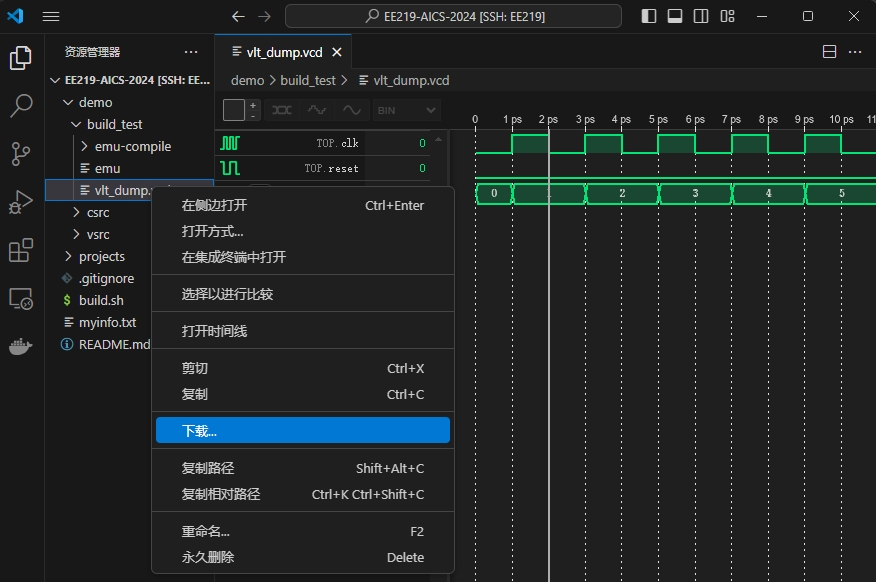

# Instructions for the usage
### Config Git

After the connection to the remote-desk server, open the terminal in VS-Code and config the git like the following command.

```bash
# config the user name with your real name
git config --global user.name "2024xxxxx-ZhangSan"
# config the user email with your real email
git config --global user.email "2024xxxxx@shanghaitech.edu.cn"
```

### Fill your information

After the connection to the container, you can view the files in the container.

First of all, you should fill your information in [myinfo.txt](../myinfo.txt)

**Note!!! If you did not fill the information, you could not be able to use the environment.**

## Verilator Demo

Open a new terminal and input the following commands. 
```bash
cd EE219-AICS-2024
sudo chmod +x build.sh
./build.sh -e demo -b -s
```

Note: When executing the second command, the terminal will ask you to input the test cycles and you can randomly input a number.

After that, there will be a new folder, `build_test` in the dir `/home/ubuntu/EE219-AICS-2024/demo`. There are some intermidate simulation files and the final vcd waveform file. With the help of `wavetrace`, we can directly view the vcd waveform in VS-Code.

<div align=center>

</div>

You can also download the vcd waveform file and view the waveform in you local desktop using `gtkwave`.

<div align=center>

</div>
