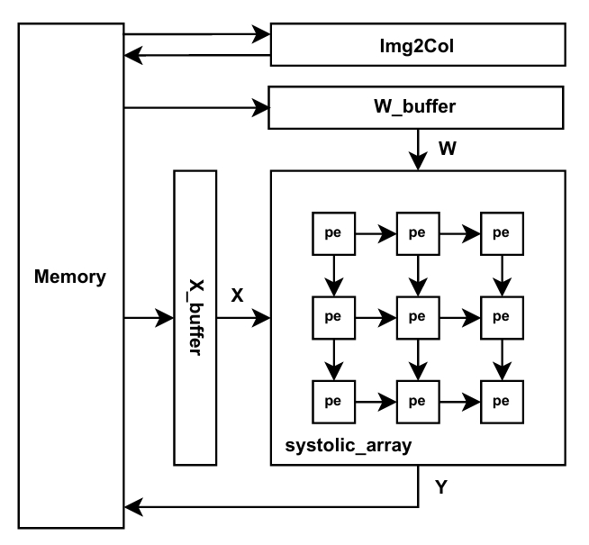
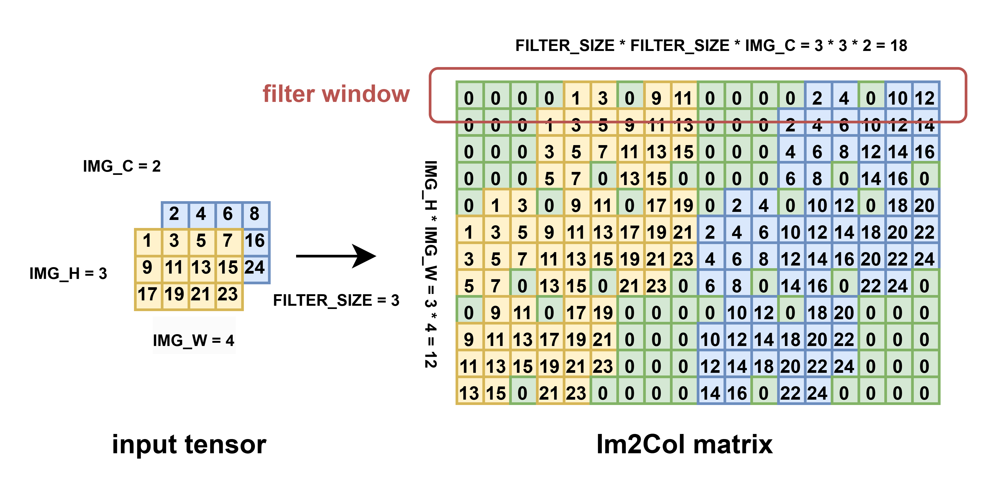
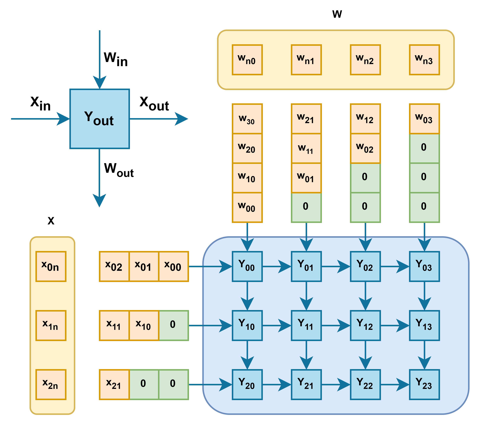
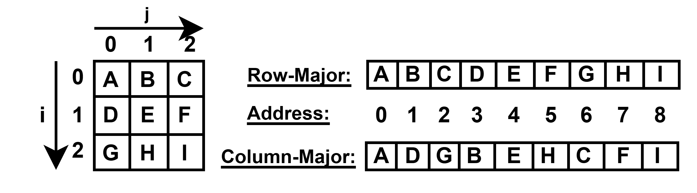
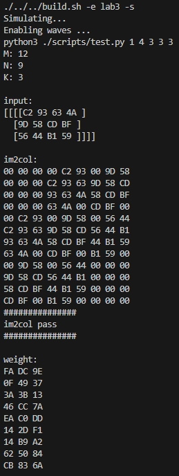
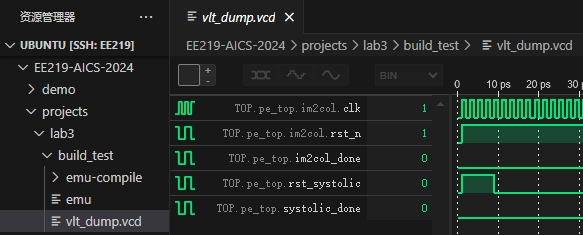
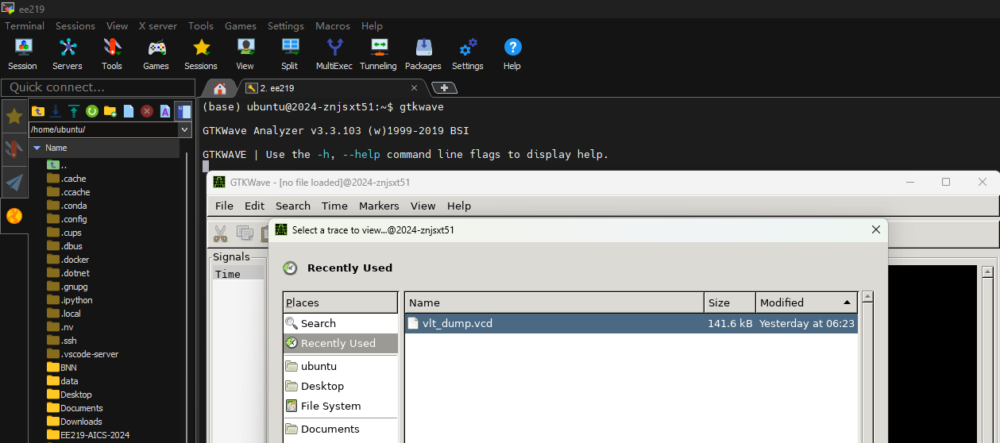

# Lab3: Systolic Array for Conv2D

## Introduction
This lab focuses on designing a **systolic array** based system to accelerate the convolutional computations in CNNs by transforming convolution operations into **General Matrix Multiplications (GEMM)**. The diagram of the system design is shown below.

In this lab, you need to implement the **Img2Col**, the **Systolic Array**, and the internal **PE (Processing Element)**. The **Img2Col** converts the input within each convolution window into vectors and stacks them into a new matrix, storing them in memory in column-major order. The **systolic\_array** module instantiates an **output-stationary** systolic array composed of PEs, it receives the activation X from the **X\_buffer** and the weight W from the **W\_buffer**. After all computations are completed, the output **Y** from the accumulators in the PEs is written back to memory.

<p align="center">
  
</p>
<p align = "center">
  <i>System Top Diagram</i>
</p>

Next, we will explore how to map Conv2D operations to GEMM and the advantages of using a systolic array for such tasks.

### Convolutional Layer Computation
In CNNs, the input to a convolutional layer is generally represented as a 4-dimensional tensor with the shape (N, C, H, W) for NCHW format or (N, H, W, C) for NHWC format, where:

- **N**: Number of input samples (batch size), 1 for this lab.
- **C**: Number of input channels.
- **H**: Height of the input image.
- **W**: Width of the input image.

And we will use IMG\_C, IMG\_H, IMG\_W to describe the dimension of input. 

Convolutional filters are represented as another tensor with dimensions (FILTER\_NUM, IMG\_C, FILTER\_SIZE, FILTER\_SIZE), where:

- **FILTER\_NUM**: Number of filters, representing the number of output channels.
- **IMG\_C**: Number of channels which should be the same as the input's.
- **FILTER\_SIZE**: Height and width of the filter (assuming square filters).

The output dimensions of the convolutional layer are given by:

- **OUT\_H** = (IMG\_H + 2 * PADDING - FILTER\_SIZE) // STRIDE + 1

- **OUT\_W** = (IMG\_W + 2 * PADDING - FILTER\_SIZE) // STRIDE + 1

In this lab, the STRIDE is always 1 and the OUT\_H/W always equals to IMG\_H/W. 

### Mapping Convolution Computation to GEMM Using Img2Col
To leverage the efficiency of matrix multiplications in systolic arrays, the convolution operation can be transformed to GEMM. This transformation is facilitated through the **img2col (Image to Column)** method, which **unfolds the input tensor into columns** suitable for matrix multiplication.

1. **Expand the Input Image**: Apply zero-padding of size PADDING to the input tensor to fit the convolution requirements.

2. **Construct Input Matrix X**: Flatten the padded tensor into matrix X with dimensions (OUT\_H * OUT\_W, FILTER\_SIZE * FILTER\_SIZE * IMG\_C). Here, each row of matrix X corresponds to the receptive field of the filter at a particular location on the input image.

<p align="center">
  
</p>
<p align = "center">
  <i>Example of Img2Col</i>
</p>

3. **Construct Weight Matrix W**: Reshape the convolutional filter tensor into matrix W with dimensions (FILTER\_SIZE * FILTER\_SIZE * IMG\_C, FILTER\_NUM).

4. **Matrix Multiplication**: Multiply matrix X by matrix W to obtain matrix Y with dimensions (OUT\_H * OUT\_W, FILTER\_NUM). 

**Note:** In the lab, we directly verify the result of the output matrix Y without converting it back into a tensor.

### Output Stationary Systolic Array

The basic component in a systolic is the **Processing Element (PE)**. For a output stationary systolic array, each PE performs multiplication using the **X_in** and **W_in**. This result is then accumulated into the local output result **Y_out** (initialized as 0 when reset). Additionally, the **X_in** and **W_in** are passed through the PE to the adjacent PEs. In each clock cycle, the systolic array receives one column of the **X** vector and one row of the **W** vector. As shown in bellow figure, the **X_in** is streamed from left side with proper offset while the **W_in** is streamed from the top. After some delay, all the output **Y** in PEs will be written back to the memory.

<p align="center">
  
</p>
<p align = "center">
  <i>Output Stationary Systolic Array</i>
</p>

### Data Storage

All the input and output data are stored on a simulated 32-bit memory, find the start addresses of each parameter in the below form. 

**Important Notice:**
1. For the input and weight tensors stored in memory, they are both stored in NHWC format. The difference between NHWC and NCHW can be seen in the figure shown below.
<p align="center">
  
</p>
<p align = "center">
  <i>NCHW & NHWC</i>
</p>

In this lab, since memory addresses are one-dimensional, for the input tensor, data from the **IMG_C** dimension is stored **first**, followed by the **IMG_W** dimension, and **finally** the **IMG_H** dimension.
For the weight tensor, data from the **IMG_C** dimension is stored **first**, followed by the **FILTER_W** dimension, then the **FILTER_H** dimension, and **finally** the **FILTER_NUM** dimension.

2. The two-dimensional **matrix X** obtained after **Im2Col** has a shape of (IMG_H * IMG_W, FILTER_SIZE * FILTER_SIZE * IMG_C) and is stored in **X_buffer** in **column-major** order. 
The weight **matrix W**, with a shape of (FILTER_SIZE * FILTER_SIZE * IMG_C, FILTER_NUM), and the GEMM output matrix , with a shape of (IMG_H * IMG_W, FILTER_NUM), are stored in **W_buffer** and **Y** in **row-major** order, respectively.

<p align="center">
  
</p>
<p align = "center">
  <i>Row-major & Column-major</i>
</p>


| Name | Value | Description |
| - | - | - |
| IMG_BASE | 0x00000000 | image start address |
| WEIGHT_BASE | 0x00001000 | weights start address |
| IM2COL_BASE | 0x00002000 | im2col start address |
| OUTPUT_BASE | 0x00003000 | output start address |

## Design Specification

You need to implement three modules (im2col, PE, and systolic_array) as described below using **Verilog**.

### Module im2col (im2col.v)

This module performs the im2col conversion. You need to read image values from memory and write them back to the proper location. (Here, we consider two cases for FILTER_SIZE: 1 and 3.)

#### Parameters

| name | description |
| - | - |
| IMG_C | image channel |
| IMG_W | image width |
| IMG_H | image height |
| DATA_WIDTH | data width |
| ADDR_WIDTH | address width |
| FILTER_SIZE | size of convolution kernel(e.g. 3 means 3x3 kernel) |
| IMG_BASE | image base address |
| IM2COL_BASE | im2col base address |

#### Ports

| name | type | width | description |
| - | - | - | - |
| clk | input | 1 | clock signal |
| rst\_n | input | 1 | reset signal (active LOW) |
| data_rd | input | DATA_WIDTH | the value read from memory |
| data_wr | output | DATA_WIDTH | the value write to memory |
| addr_rd | output | ADDR_WIDTH | memory read address |
| addr_wr | output | ADDR_WIDTH | memory write address |
| done | output | 1 | oepration done signal |
| mem_wr_en | output | 1 | memory write enable |

#### Module Behaviour

* Begin im2col conversion when `rst_n` is pulled up, pull `done` up when finish.
* The memory can be read and write once per clock cycle.
* Use **zero-padding** in 2D convolution for 3x3 kernels, whereas for 1x1 kernels, padding is not needed.

### Module PE (pe.v)

The basic function of PE is calculating the products of the input and weight,accumulating the partial sums and streaming the input and weight to its neighbors.

**Notes:** It should be noted that the DATA_WIDTH for both input and output is always 32, so there's no need to worry about overflow issues during multiplication and addition operations. When testing, we use 8-bit unsigned data. When implementing multiplication, after performing the multiplication and addition operations on two DATA_WIDTH bits, the highest DATA_WIDTH bits can simply be ignored.
#### Parameters

| name | description |
| - | - |
| DATA_WIDTH | data width |

#### Ports

| name | type | width | description |
| - | - | - | - |
| clk | input | 1 | clock signal |
| rst_n | input | 1 | reset signal (active LOW) |
| x_in | input | DATA_WIDTH | input x |
| w_in  | input | DATA_WIDTH | input w |
| x_out | output | DATA_WIDTH | output x |
| w_out | output | DATA_WIDTH | output w |
| y_out | output | DATA_WIDTH | output y |


#### Module Behaviour

* Compute `y_out = x_in*w_in + y_out` in every clock cycle.
* Streaming out registered version of `x_in` to `x_out`.
* Streaming out registered version of `w_in` to `w_out`.
* Reset all the outputs to zero on `rst_n`.

### Module Systolic Array (systolic_array.v)

The systolic array is constructed by instantiate PE modules. You need to connect the PEs properly and do shifts on the input and output.
In this lab, we assume that the size of the systolic array matches the size of the output matrix. Specific parameters are listed in the table.

#### Parameters

| name | description | value|
| - | - |-|
| M | number of rows in X  |IMG_H * IMG_W|
| N | number of columns in X  |FILTER_SIZE * FILTER_SIZE * IMG_C|
| K | number of rows in W |FILTER_NUM |
| DATA_WIDTH | data width |default: 32|

#### Ports

| name | type | width | description |
| - | - | - | - |
| clk | input | 1 | clock signal |
| rst_n | input | 1 | reset signal |
| X | input | DATA_WIDTH\*M | inputs on X side (one column of X) |
| W | input | DATA_WIDTH\*K | weights on W side (one row of W) |
| Y | output | DATA_WIDTH\*M\*K | outputs in all PEs |
| done | output | 1 | operation done signal |

#### Module Behaviour

* reset all the outputs to zero on `rst_n`.
* pull `done` up when the last `Y` is valid.

**Notes:** After the `done` signal is raised, the data in `Y` will be immediately written back to memory. 
However, in practical accelerator scenarios, writing all `Y` back to memory at once is impractical; 
here, for simplification, we assume that this operation is completed in one cycle.

## Simulation Environment
### Tools
We primarily use `Verilator` for simulation and view waveforms through VS-Code's `WaveTrace` extension or `gtkwave`.

`Verilator` has been installed on the cloud platform, it is an open-source tool that supports Verilog and SystemVerilog simulation. It features functions such as code quality checks, capable of compiling given circuit designs into C++. Afterward, a wrapper file is written to call the intermediate files generated earlier, which are then uniformly compiled and executed by a C compiler to complete the simulation.
 
### File location
The three module files with ports defination are located in `vsrc/src/`

### Run single test
You may activate the conda environment containing numpy by `conda activate torch`.

Simply run `make` under folder `lab3`, it will automatically generate inputs and do a test on your design. If you pass the test, the terminal will show something like

<center class="center">

</center>
<center class="center">

</center>

(numbers are printed in hexadecimal)

#### Specifiy parameters
You can specify the parameters like
```
make IMG_C=1 IMG_W=1 IMG_H=1 FILTER_NUM=1 FILTER_SIZE=3
```

#### Debug
After simulation, there will be a new folder, `build_test` in the `lab3` dir. There are some intermidate simulation files and the final `*.vcd` waveform file. With the help of `WaveTrace`, we can directly click and view the `*.vcd` waveform in VS-Code. 

<center class="center">

</center>


However, `WaveTrace` can only display waveforms for up to eight signals, and the virtual desktop also has `gtkwave` software pre-installed. Since VS-Code does not support a graphical interface, we can use `MobaXterm` to establish an SSH remote connection to the server, or connect to the server via the web interface or client of `VMWare`. By entering `gtkwave` in the terminal, the software can be launched. To open a `*.vcd` file, go to `File -> Open New Tab`.

<center class="center">

</center>

#### Clean
It is recommended to run `make clean` before every simulation.

### Run multiple tests
Run the scripts
```
bash scripts/run_test.sh
```
It will do multiple tests using parameters read from `test/cases.txt`, you can also add your own cases to it. The result are saved in file `test/result.txt`.

## Grading
### Code (80%)
* Complete im2col (20%)
* Complete systolic array (80%)
  * Fail all the tests (0%)
  * Pass N tests (20% + 4% * N)

Your code will be tested by the same testcases in `test/cases.txt`.

### Report (20%)
The report should be written in English and follows the [IEEE double-column template](https://www.ieee.org/conferences/publishing/templates.html). Only PDF format is acceptable.

A good report should includes following components:
* An introduction to briefly introduce the system design.
* Implementation details for each of the modules.
* A strong conclusion to assess and summarize your design.

## Submission
Please compress all the files in your `vsrc/src` folder into a `zip` file with name `{StudentNumber}_EE219_Lab3.zip`, and submit to Blackboard. The file structure should be like
```
2024123123_EE219_Lab3/
|-- report.pdf
|-- src
    |-- im2col.v
    |-- pe.v
    |-- systolic_array.v
    `-- ...
```
