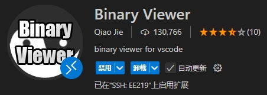
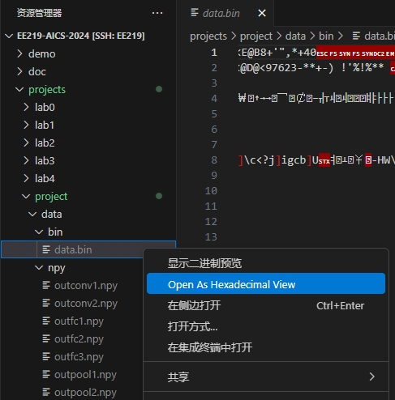
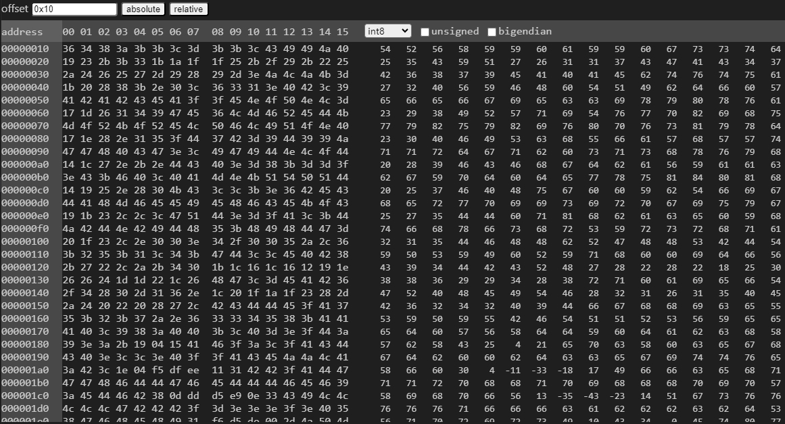
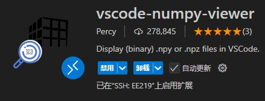
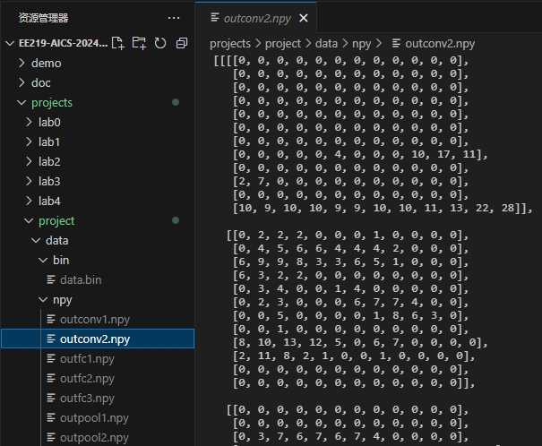
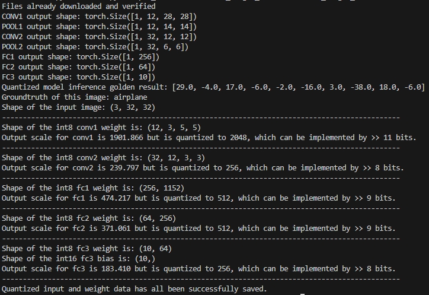
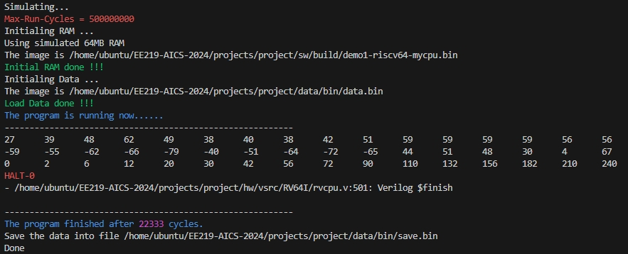
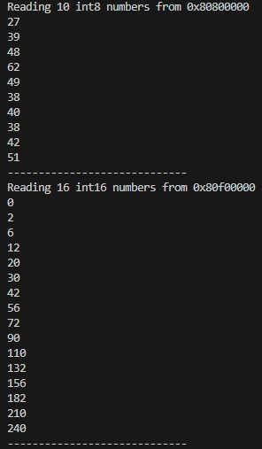

# EE219 2024 Fall Final Project
## Introduction
This project is designed to allow you to apply what you have learned throughout this course. It provides an opportunity to design your own AI computing system, which includes model training, model quantization, hardware design and operator development. Bon Voyage!

## Project Goal
The goal of this project is to design an AI computing system that enables computational acceleration of a neural network. The system is divided into three levels: **neural network**, **hardware platform** and **application software**. The basic requirement is to deploy the whole network and ensure that the simulation results running on hardware are consistent with those running in Python.


### Neural Networks
You need to analyze the characteristics of different network layers (such as memory-intensive or computation-intensive) and the data layout format during storage. Utilize the [quantized model](./tool/model_lab2.pth) provided by TA from [Lab 2](../lab2/) directly.

### Hardware Platform
Based on the knowledge of designing an accelerator for Conv2D using a systolic array from [Lab 3](../lab3/) and understanding the structure of a general-purpose processor like the RISC-V32IMV processor from [Lab 4](../lab4/), design a custom hardware computing platform to deploy your neural network model.

### Application Software
Integrate the skills of using the numpy library in Python to build neural networks from [Lab 1](../lab1) and using assembly language for MAC operations from [Lab 4](../lab4/). Employ C + inline assembly to build the neural network arithmetic library and complete the corresponding software for your custom computing platform to ensure the correct operation of the neural network.

## Detailed Task
### Neural-Networks

You need to implement the entire network, including convolutional layers with output quantization and ReLU, pooling layers, and fully connected layers, and store the final 10-class result at the specified address (`ADDR_OUTFC3`). You can refer to this [head file](./sw/include/model.h). If there is a need to cache the output results of intermediate layers, we also provide storage addresses for those in the same head file. Here are some reminders for your reference.

#### 1. Output Quantization: A Hardware Friendly Approach?
To deploy a neural network to hardware, it is usually necessary to quantize the model, as done in [Lab 2](../lab2/). However, the quantization in [Lab 2](../lab2/) does not account for the specific hardware constraints. 

For instance, in [Lab 2](../lab2/), we used a **floating-point** scaling factor to adjust the output scale for each layer. But since our hardware platform does not support **floating-point** operations, we need to convert **floating-point** operations into **integer** operations. We can convert the division into multiplication in advance at the software level, and then approximate this multiplier with **powers of two**. In hardware, this operation can be implemented by right-shifting operations. Thus, we can derive the **integer** shift bit number to replace the **floating-point** scaling factor.

For instance, for the first convolution layer, the original `floating-point` scale is 1901.87, but we approximate it to 2048 (*2048 is the nearest power of two number to 1901.87*). Originally, dividing by 1901.87 can be replaced by a right shift of 11 bits. It is important to note that there may be rounding operations after the right shift, similar to how division can result in fractions. We maintain the same rounding method as in PyTorch's `torch.round` function. Please explore the underlying logic and implement it appropriately in hardware.

#### 2. NCHW v.s. NHWC ? 
The [model](data/model_lab2.pth) we provided to you already includes quantized `int8` weights as well as `int8` shift bits for quantizing output activations. We have also provided you with a [script](./tool/model.py) that exports the quantized `int8` model inputs, quantized `int8` weights, `int16` biases (only for the `FC3` layer), and `int8` scaling factors into a `.bin` file under `./data/bin`. 


The activations and weights of the convolutional layer are four-dimensional tensors stored in the `NCHW` format by default. However, in our previous [Lab 3](../lab3/), we found that the `NHWC` format may offer better memory access efficiency. Therefore, we provide you with the flexibility to choose. Please refer to the Line 8-11 in [Makefile](./Makefile), where `NCHW` storage is used by default. If you want to store inputs or weights in `NHWC` format, simply set them to `true`. Similarly, the activations and weights of the fully connected layers are two-dimensional tensors. You can modify the [Makefile](./Makefile) as needed to store transposed weights. Note that the shape of the data during storage will be printed in the terminal, and we will also export the intermediate computation results of the network into `.npy` files for debugging purposes under `./data/npy`.


### Hardware-Platform
Our hardware platform uses the RISC-V processor architecture and supports all RV64I instructions, along with some custom vector instructions. A single-cycle scalar processor core supporting RV64I has been implemented and is available for use. However, since [Lab 4](../lab4/) is still in progress, the source code for this scalar processor core is obfuscated. The focus of your design will be on the vector processor part of the platform.

You can embed a custom accelerator into the ALU of the vector processor, considering the large access bandwidth of the vector processor. This project does not require complex instructions for the vector processor, and you can use the code from [Lab 4](../lab4/) with simple modifications. However, to control the accelerator, you will need to add some custom vector instructions.

The accelerator architecture is not restricted, but you must provide reasonable justification for your design choices. For example, using an excessive number of registers or arithmetic units would not be acceptable. In short, your accelerator should be as efficient as possible while matching the access bandwidth.

### Application-Software
Since our intelligent computing system is processor-based, we need software to control the processor and make it perform the desired operations. After completing the first two parts, you will need to build an operator library to support the specific computations of the neural network. Most of this can be done using C, but for sections involving vector instructions (including custom instructions), you will need to use inline assembly. [Sample programs](./sw/) will be provided to help you with both cases.

## Environment
### Additional Tool Installation
You must install the `gcc-riscv64-linux-gnu tool` first.
```bash
sudo apt install gcc-riscv64-linux-gnu
```
You can use the command to check if you has installed the tool successfully.
```bash
riscv64-linux-gnu-gcc --help
```
### Permission to Run Scripts
You need to add the execution permission to the `*.sh` file.
```bash
chmod +x -R /home/ubuntu/EE219-AICS-2024/projects/project
```
### Conda Environment
To run the python code, you also need to activate the conda-environment torch.
```bash
conda activate torch
```
### Useful Extensions
- Binary Viewer



Since the data is saved as binary bin files, which are less readable, it is recommended to install this extension. When using it, simply select the `*.bin` file, right-click on it, and choose "Open As Hexadecimal View". 



You can choose the type of data display as `int8`. In the `offset`, you can fill in the hexadecimal address, and then you can quickly locate the data you want. 



- vscode-numpy-viewer



We have provided references for intermediate calculation results, which are saved in the `.npy` format and stored in the default `NCHW` storage mode. To view the data in the `*.npy` file intuitively, it is recommended to install this extension. After the installation is completed, you can simply click on the `*.npy` file to view it. 



## Useful Commands
### Make Clean First
We recommend clearing the temporary files before simulation.
```bash
make clean
```

### Parse Model
Running the following commands will automatically run the [script](./tool/model.py) that parses the [model](./tool/model_lab2.pth) we provided. It will display the number of parameters for the input, output, activation, and weights of each layer in the terminal, and save the intermediate activation results during runtime as `.npy `files, and save the quantized input and model parameters as `.bin` files. 

```bash
make model
```



### Run Simulation
The programs in your software part should be of the `*.c` type. When running the simulation, use its name as the value of `CFILE`. For example, the following commands are used to run different sample programs. The terminal displays the number of cycles required for the processor simulation.
``` bash
make run CFILE=demo1
make clean
make run CFILE=demo2
make clean
make run CFILE=hello-str
```


### RAM Reader for Debug
After the simulation is completed, the values in the memory at this time are saved as `./data/save.bin`. You can use the following script to print the values in the memory. The default main program in the script is to print 10 consecutive `int8` numbers starting from the address of `ADDR_INPUT` and 16 consecutive int16 numbers starting from the address of `ADDR_SAV`E after running `demo1`.  
```bash
cd tool
python ram_reader.py
```



## Score
The final specific scoring criteria will be released later. In the competition, we will run the codes submitted by each group and rank them based on the number of cycles. The ranking will start two weeks after the Project is released. Additionally, although this is a group project, code-level reference among groups is **not allowed**.

- Report (30%)
    - Neural-Networks (10%)
    - Hardware-Platform (10%)
    - Application-Software (10%)
- Code (60%)
    - HW (50%)
        - Convolution (15%)
        - ReLU (10%)
        - Pooling (10%)
        - FC (15%)
    - SW (10%)
- Competition (10%)

## Submission
Using the make command to export the git log file and pack up the `project` folder. You will get the compressed file `project.tar.gz` in `EE219-AICS-2024/projects`.
``` bash
make pack
```
Please compress `project.tar.gz` and the report into a `zip` file with the name `{ID1_Name1_ID2_Name2...}_EE219_Project.zip`, and submit to Blackboard. The file structure should be like this.
```bash
2024123456_李华_2023987654_李雷_EE219_Project.zip
|-- report.pdf
|-- project.tar.gz
```